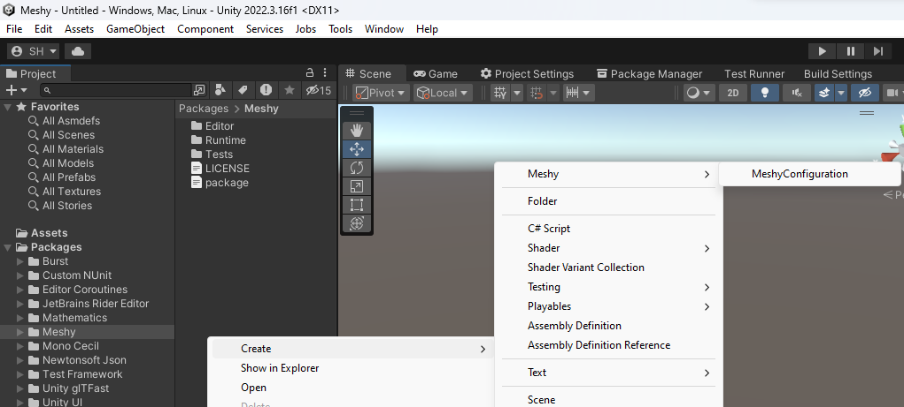
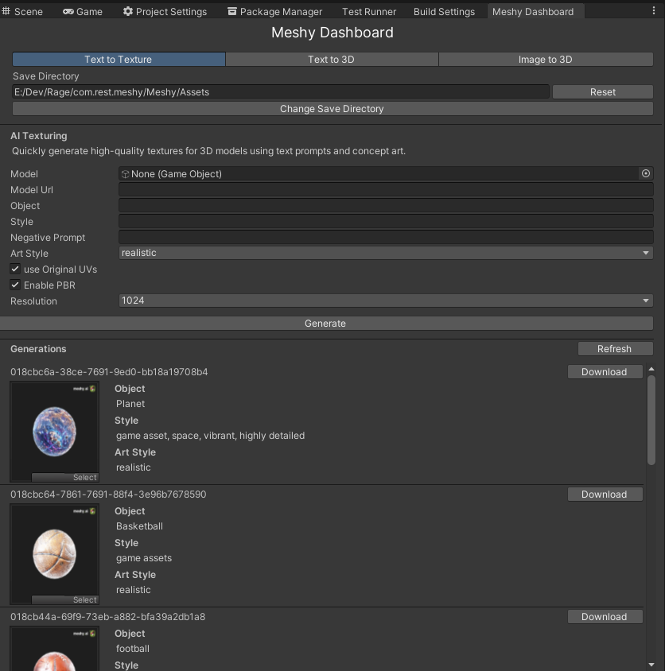
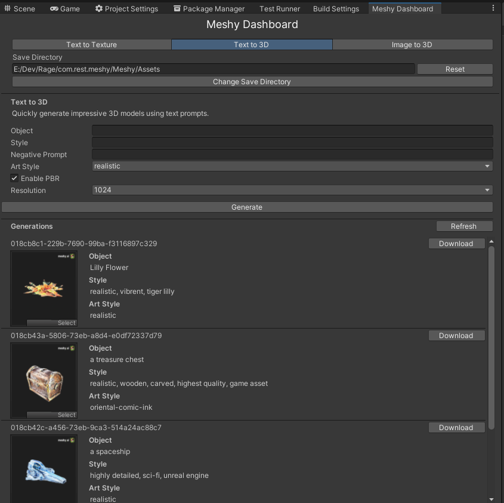
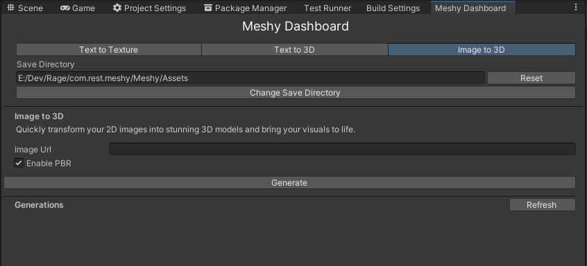

# com.rest.meshy

[](https://discord.gg/xQgMW9ufN4) [](https://openupm.com/packages/com.rest.meshy/) [](https://openupm.com/packages/com.rest.meshy/)

A Meshy package for the [Unity](https://unity.com/) Game Engine.

***All copyrights, trademarks, logos, and assets are the property of their respective owners.***

> This repository is available to transfer to the Meshy organization if they so choose to accept it.

## Installing

Requires Unity 2021.3 LTS or higher.

The recommended installation method is though the unity package manager and [OpenUPM](https://openupm.com/packages/com.rest.meshy).

### Via Unity Package Manager and OpenUPM

- Open your Unity project settings
- Select the `Package Manager`

- Add the OpenUPM package registry:
  - Name: `OpenUPM`
  - URL: `https://package.openupm.com`
  - Scope(s):
    - `com.rest.meshy`
- Open the Unity Package Manager window
- Change the Registry from Unity to `My Registries`
- Add the `Meshy` package

### Via Unity Package Manager and Git url

- Open your Unity Package Manager
- Add package from git url: `https://github.com/RageAgainstThePixel/com.rest.meshy.git#upm`
  > Note: this repo has dependencies on other repositories! You are responsible for adding these on your own.
  - [com.utilities.async](https://github.com/RageAgainstThePixel/com.utilities.async)
  - [com.utilities.extensions](https://github.com/RageAgainstThePixel/com.utilities.extensions)
  - [com.utilities.rest](https://github.com/RageAgainstThePixel/com.utilities.rest)

---

## Documentation

### Table of Contents

- [Authentication](#authentication)
- [Dashboard](#dashboard)
- [Text to Texture](#text-to-texture)
  - [List Text to Texture Tasks](#list-text-to-texture-tasks)
  - [Create Text to Texture Task](#create-new-text-to-texture-task)
- [Text to 3D](#text-to-3d)
  - [List Text to 3D Tasks](#list-text-to-3d-tasks)
  - [Create Text to 3D Task](#create-new-text-to-3d-task)
- [Image to 3D](#image-to-3d)
  - [List Image to 3D Tasks](#list-image-to-3d-tasks)
  - [Create Image to 3D Task](#create-new-image-to-3d-task)

### [Authentication](https://docs.meshy.ai/api-authentication)

There are 4 ways to provide your API keys, in order of precedence:

:warning: We recommended using the environment variables to load the API key instead of having it hard coded in your source. It is not recommended use this method in production, but only for accepting user credentials, local testing and quick start scenarios.

1. [Pass keys directly with constructor](#pass-keys-directly-with-constructor) :warning:
2. [Unity Scriptable Object](#unity-scriptable-object) :warning:
3. [Load key from configuration file](#load-key-from-configuration-file)
4. [Use System Environment Variables](#use-system-environment-variables)

You use the `MeshyAuthentication` when you initialize the API as shown:

#### Pass keys directly with constructor

:warning: We recommended using the environment variables to load the API key instead of having it hard coded in your source. It is not recommended use this method in production, but only for accepting user credentials, local testing and quick start scenarios.

```csharp
var api = new MeshyClient("msy_apikey123");
```

Or create a `MeshyAuthentication` object manually

```csharp
var api = new MeshyClient(new MeshyAuthentication("msy_apikey123"));
```

#### Unity Scriptable Object

You can save the key directly into a scriptable object that is located in the `Assets/Resources` folder.

You can create a new one by using the context menu of the project pane and creating a new `MeshyConfiguration` scriptable object.

:warning: Beware checking this file into source control, as other people will be able to see your API key.



#### Load key from configuration file

Attempts to load api keys from a configuration file, by default `.meshy` in the current directory, optionally traversing up the directory tree or in the user's home directory.

To create a configuration file, create a new text file named `.meshy` and containing the line:

> Organization entry is optional.

##### Json format

```json
{
  "apiKey": "msy_apikey123"
}
```

You can also load the configuration file directly with known path by calling static methods in `MeshyAuthentication`:

- Loads the default `.meshy` config in the specified directory:

```csharp
var api = new MeshyClient(new MeshyAuthentication().LoadFromDirectory("path/to/your/directory"));
```

- Loads the configuration file from a specific path. File does not need to be named `.meshy` as long as it conforms to the json format:

```csharp
var api = new MeshyClient(new MeshyAuthentication().LoadFromPath("path/to/your/file.json"));
```

#### Use System Environment Variables

Use your system's environment variables specify an api key and organization to use.

- Use `MESHY_API_KEY` for your api key.

```csharp
var api = new MeshyClient(new MeshyAuthentication().LoadFromEnvironment());
```

### Dashboard

You can perform the same tasks in the dashboard as you would in the webapp.

> pro-tip: You can also use the context window to quickly access in editor options for prefabs and scene objects!

Access the dashboard via `Window/Dashboards/Meshy`


- [Generate textures for an existing 3D model](#text-to-texture).
  
- [Generate a 3D model from a text prompt](#text-to-3d).
  
- [Generate a 3d model from an image](#image-to-3d).
  

### Text to texture

Quickly generate high-quality textures for your existing 3D models using text prompts and concept art.

#### List Text to texture tasks

```csharp
var api = new MeshyClient();
var textToTextureTasks = await api.TextToTextureEndpoint.ListTasksAsync(1, 12, SortOrder.Descending);

foreach (var meshyTask in textToTextureTasks)
{
    Debug.Log($"{meshyTask.Id} | created_at: {meshyTask.CreatedAt}");
}
```

#### Create new text To texture task

Creates a new text to texture task, and reports progress until the task is completed.

Pass in a prefab or scene GameObject to be re-textured:

```csharp
var api = new MeshyClient();
var sphere = GameObject.CreatePrimitive(PrimitiveType.Sphere);
var request = new TextToTextureRequest(sphere, "Basketball", "game assets", enableOriginalUV: false, resolution: Resolutions.X1024, artStyle: ArtStyles.Realistic);
var taskResult = await MeshyClient.TextToTextureEndpoint.CreateTextToTextureTaskAsync(request, new Progress<TaskProgress>(progress => Debug.Log($"[{progress.Id}] {progress.Status}: {progress.PrecedingTasks ?? progress.Progress}")));
Assert.IsNotNull(taskResult);
Debug.Log($"{taskResult.Id} | created_at: {taskResult.FinishedAt} | expires_at: {taskResult.ExpiresAt}");
```

If you need more control over the glb export process you can also pass in your own `GLTFast.Export.GameObjectExport` object:

```csharp
var api = new MeshyClient();
var sphere = GameObject.CreatePrimitive(PrimitiveType.Sphere);
var exportSettings = new ExportSettings
{
    Format = GltfFormat.Binary,
    FileConflictResolution = FileConflictResolution.Overwrite,
    ComponentMask = ~(ComponentType.Camera | ComponentType.Animation | ComponentType.Light),
};
var gameObjectExportSettings = new GameObjectExportSettings
{
    OnlyActiveInHierarchy = false,
    DisabledComponents = true,
};
var glbExport = new GameObjectExport(exportSettings, gameObjectExportSettings);
glbExport.AddScene(new[] { sphere });
var request = new TextToTextureRequest(glbExport, "Planet", "game asset, space, vibrant, highly detailed", enableOriginalUV: false, resolution: Resolutions.X1024, artStyle: ArtStyles.Realistic);
var taskResult = await MeshyClient.TextToTextureEndpoint.CreateTextToTextureTaskAsync(request, new Progress<TaskProgress>(progress => Debug.Log($"[{progress.Id}] {progress.Status}: {progress.PrecedingTasks ?? progress.Progress}")));
Assert.IsNotNull(taskResult);
Debug.Log($"{taskResult.Id} | created_at: {taskResult.FinishedAt} | expires_at: {taskResult.ExpiresAt}");
```

You can also use a public url:

```csharp
var api = new MeshyClient();
var modelUrl = "https://github.com/KhronosGroup/UnityGLTF/raw/master/UnityGLTF/Assets/StreamingAssets/Lantern/glTF-Binary/Lantern.glb"
var request = new TextToTextureRequest(modelUrl, "Lantern", "game assets", resolution: Resolutions.X1024, artStyle: ArtStyles.Realistic);
var taskResult = await api.TextToTextureEndpoint.CreateTextToTextureTaskAsync(request, new Progress<TaskProgress>(progress => Debug.Log($"[{progress.Id}] {progress.Status}: {progress.PrecedingTasks ?? progress.Progress}")));
Debug.Log($"{taskResult.Id} | created_at: {taskResult.FinishedAt} | expires_at: {taskResult.ExpiresAt}");
```

### Text to 3D

Quickly generate impressive 3D models using text prompts.

#### List text to 3D tasks

```csharp
var api = new MeshyClient();
var textTo3DTasks = await MeshyClient.TextTo3DEndpoint.ListTasksAsync(1, 12, SortOrder.Descending);

foreach (var meshyTask in textTo3DTasks)
{
    Debug.Log($"{meshyTask.Id} | created_at: {meshyTask.CreatedAt}");
}
```

#### Create new text to 3D task

```csharp
var request = new TextTo3DRequest("a treasure chest", "realistic, wooden, carved, highest quality", resolution: Resolutions.X1024, artStyle: ArtStyles.Realistic);
var taskResult = await MeshyClient.TextTo3DEndpoint.CreateTextTo3DTaskAsync(request, new Progress<TaskProgress>(progress => Debug.Log($"[{progress.Id}] {progress.Status}: {progress.PrecedingTasks ?? progress.Progress}")));
Debug.Log($"{taskResult.Id} | created_at: {taskResult.FinishedAt} | expires_at: {taskResult.ExpiresAt}");
```

### Image to 3D

Quickly transform your 2D images into stunning 3D models and bring your visuals to life.

#### List image to 3D tasks

> :warning: [Currently does not work with current API version](https://github.com/RageAgainstThePixel/com.rest.meshy/issues/2).

```csharp
var api = new MeshyClient();
var imageTo3dTasks = await api.ImageTo3DEndpoint.ListTasksAsync(1, 12, SortOrder.Descending);

foreach (var meshyTask in imageTo3dTasks)
{
    Debug.Log($"{meshyTask.Id} | created_at: {meshyTask.CreatedAt}");
}
```

#### Create new image to 3D task

```csharp
var imageUrl = "https://raw.githubusercontent.com/KhronosGroup/glTF-Sample-Assets/main/Models/Fox/screenshot/screenshot-x150.jpg";
var request = new ImageTo3DRequest(imageUrl);
var taskResult = await MeshyClient.ImageTo3DEndpoint.CreateImageTo3DTaskAsync(request, new Progress<TaskProgress>(progress => Debug.Log($"[{progress.Id}] {progress.Status}: {progress.PrecedingTasks ?? progress.Progress}")));
Assert.IsNotNull(taskResult);
Debug.Log($"{taskResult.Id} | created_at: {taskResult.FinishedAt} | expires_at: {taskResult.ExpiresAt}");
```
