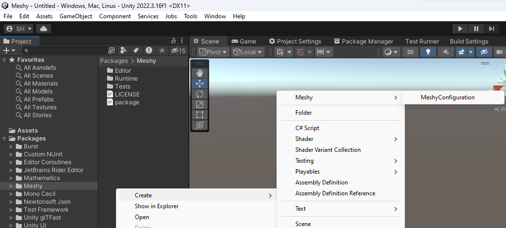

# com.rest.meshy

[](https://discord.gg/xQgMW9ufN4) [](https://openupm.com/packages/com.rest.meshy/) [](https://openupm.com/packages/com.rest.meshy/)

A Meshy package for the [Unity](https://unity.com/) Game Engine.

***All copyrights, trademarks, logos, and assets are the property of their respective owners.***

> This repository is available to transfer to the Meshy organization if they so choose to accept it.

## Installing

Requires Unity 2021.3 LTS or higher.

The recommended installation method is though the unity package manager and [OpenUPM](https://openupm.com/packages/com.rest.meshy).

### Via Unity Package Manager and OpenUPM

- Open your Unity project settings
- Select the `Package Manager`

- Add the OpenUPM package registry:
  - Name: `OpenUPM`
  - URL: `https://package.openupm.com`
  - Scope(s):
    - `com.rest.meshy`
- Open the Unity Package Manager window
- Change the Registry from Unity to `My Registries`
- Add the `Meshy` package

### Via Unity Package Manager and Git url

- Open your Unity Package Manager
- Add package from git url: `https://github.com/RageAgainstThePixel/com.rest.meshy.git#upm`
  > Note: this repo has dependencies on other repositories! You are responsible for adding these on your own.
  - [com.utilities.async](https://github.com/RageAgainstThePixel/com.utilities.async)
  - [com.utilities.extensions](https://github.com/RageAgainstThePixel/com.utilities.extensions)
  - [com.utilities.rest](https://github.com/RageAgainstThePixel/com.utilities.rest)

---

## Documentation

### Table of Contents

- [Authentication](#authentication)
- [Dashboard](#dashboard)
- [Text to Texture](#text-to-texture)
- [Text to 3D](#text-to-3d)
- [Image to 3d](#image-to-3d)

### [Authentication](https://docs.meshy.ai/api-authentication)

There are 4 ways to provide your API keys, in order of precedence:

:warning: We recommended using the environment variables to load the API key instead of having it hard coded in your source. It is not recommended use this method in production, but only for accepting user credentials, local testing and quick start scenarios.

1. [Pass keys directly with constructor](#pass-keys-directly-with-constructor) :warning:
2. [Unity Scriptable Object](#unity-scriptable-object) :warning:
3. [Load key from configuration file](#load-key-from-configuration-file)
4. [Use System Environment Variables](#use-system-environment-variables)

You use the `MeshyAuthentication` when you initialize the API as shown:

#### Pass keys directly with constructor

:warning: We recommended using the environment variables to load the API key instead of having it hard coded in your source. It is not recommended use this method in production, but only for accepting user credentials, local testing and quick start scenarios.

```csharp
var api = new MeshyClient("msy_apikey123");
```

Or create a `MeshyAuthentication` object manually

```csharp
var api = new MeshyClient(new MeshyAuthentication("msy_apikey123"));
```

#### Unity Scriptable Object

You can save the key directly into a scriptable object that is located in the `Assets/Resources` folder.

You can create a new one by using the context menu of the project pane and creating a new `MeshyConfiguration` scriptable object.

:warning: Beware checking this file into source control, as other people will be able to see your API key.



#### Load key from configuration file

Attempts to load api keys from a configuration file, by default `.meshy` in the current directory, optionally traversing up the directory tree or in the user's home directory.

To create a configuration file, create a new text file named `.meshy` and containing the line:

> Organization entry is optional.

##### Json format

```json
{
  "apiKey": "msy_apikey123"
}
```

You can also load the configuration file directly with known path by calling static methods in `MeshyAuthentication`:

- Loads the default `.meshy` config in the specified directory:

```csharp
var api = new MeshyClient(new MeshyAuthentication().LoadFromDirectory("path/to/your/directory"));
```

- Loads the configuration file from a specific path. File does not need to be named `.meshy` as long as it conforms to the json format:

```csharp
var api = new MeshyClient(new MeshyAuthentication().LoadFromPath("path/to/your/file.json"));
```

#### Use System Environment Variables

Use your system's environment variables specify an api key and organization to use.

- Use `MESHY_API_KEY` for your api key.

```csharp
var api = new MeshyClient(new MeshyAuthentication().LoadFromEnvironment());
```

### Dashboard

### Text to texture

### Text to 3D

### Image to 3D
